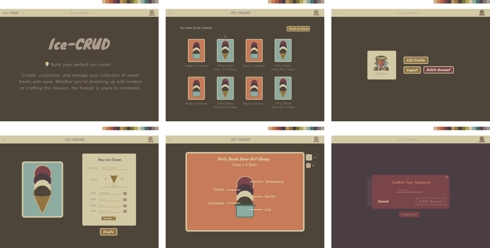

<header align="center" >
    <h1> 🍦 Ice CRUD </h1>
    
</header>

## 🤨 What is this?

**The Backend of a Full-Stack CRUD Web App**

- Customers can create, edit, view and delete custom ice creams.
- Auth is using "Access/Refresh Token Flow"
- The goal is purely learning and improvement
- Idea, structure, and design was made by me

**➜ [Frontend Here](https://github.com/cicero-mello/ice-crud-frontend)**

## 👨🏼‍💻 Main Technologies/Tools Used

**Development**
- Node.js (runtime environment)
- Fastify (framework)
- TypeScript (language)
- jsonwebtoken (implementation of JSON Web Tokens)
- Nano ID (ID generator)
- Zod (data validator)
- Prisma (ORM)
- Swagger (Api Documentation)
- PostgreSQL (database)
- Docker (isolated PostgreSQL environment)
- Vitest (testing framework)

**Others**
- Obsidian (organization tool)

## 🚀 Running Locally

**Requirements:**
- ➜ [Docker](https://www.docker.com/)
- ➜ [Git](https://git-scm.com/)
- ➜ [Node](https://nodejs.org/en)
- ➜ [NPM](https://docs.npmjs.com/cli/v11/configuring-npm/install)

--

```shell
    git clone https://github.com/cicero-mello/ice-crud-backend.git
```
```shell
    cd ice-crud-backend
```
```shell
    npm i
```
```shell
    docker compose up
```
```shell
    npm run migrate
```
```shell
    npm run dev
```

Done! Now you can run the ➜ [Frontend](https://github.com/cicero-mello/ice-crud-frontend).

--

If you want to see/manipulate the database directly:
```shell
    npm run see-db
```

##

### 🤯 My notes about this project is in ➜ [**Notion**](https://vaulted-parade-385.notion.site/Ice-CRUD-1e533bf3f417804fa788c62406127d27)

~~ (.env exposed to facilitate the "clone+running" process)
